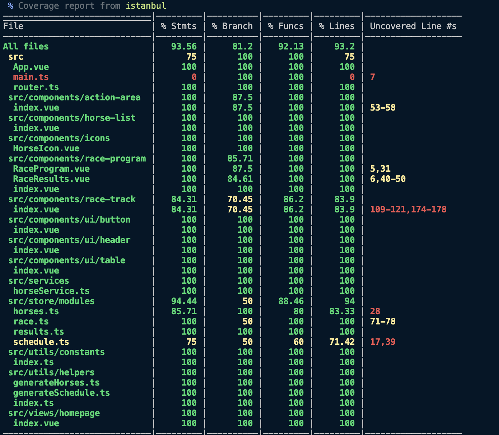

## Horse Racing App 🐎

An interactive horse racing simulation: generate a multi‑round race program, start/pause races, watch animated progress, and view per‑round results. Built with Vue 3, TypeScript, Vuex, Vite, and Vitest.


---
## Features
* Race program generation: 6 rounds, 10 random horses each (distances increase 1200 → 2200m)
* Dynamic horse generation (name, color, condition) with shuffle utilities
* Automatic round progression (next round starts immediately after finish)
* Live lane animation per horse based on estimated finish time
* Results persistence: standings stored per round
* Single-click full reset + fresh program (Generate Program)
* Start / Pause race control
* Modular Vuex store (horses, schedule, race, results)
* Full TypeScript setup
* High unit test coverage (Vitest + Vue Test Utils + Istanbul)

---
## Architecture
```
src/
	components/
		action-area/      -> Control buttons
		horse-list/       -> Horse list table
		race-track/       -> Animated track & lap status
		race-program/     -> Program + results (two panels)
		ui/               -> Reusable UI (button, table, header)
	store/
		modules/          -> horses, schedule, race, results
	utils/              -> generateHorses, generateSchedule, shuffle
	services/           -> horseService abstraction
	assets/             -> Global styles, variables, images
```

### State Flow (Summary)
1. Generate Program: resets all store slices and regenerates horses + schedule.
2. Start: initializes race with round 1 participants and distance.
3. Round finish: results recorded; if more rounds remain, next starts automatically.
4. After last round: play/pause disabled until a new program is generated.

---
## Installation
```bash
npm install
```

## Development
```bash
npm run dev
```

## Type Check & Production Build
```bash
npm run build
```

## Unit Tests
```bash
npm run test:unit
```

## Coverage Report
```bash
npm run test:coverage
```
Example output screenshot:


## Lint & Format
```bash
npm run lint
npm run format
```

---
## Key Vuex Actions / Mutations
| Module   | Action / Mutation                   | Purpose |
|----------|-------------------------------------|---------|
| horses   | initHorses                          | Generate fresh horse list |
| schedule | generateRaceSchedule                | Build full racing schedule |
| race     | startRace / pauseRace / resumeRace  | Control race lifecycle |
| race     | finishRace                          | Store results & trigger next round |
| results  | SET_RACE_RESULTS                    | Append round results |

Reset sequence: `race/RESET_STATE`, `results/RESET_RESULT_STATE`, `horses/RESET_HORSE_LIST`, `schedule/RESET_RACE_SCHEDULE`.

---
## Testing Strategy
Separate test suites for components, store modules, services, and helpers. Vitest + jsdom environment with Istanbul coverage provider.

Includes (examples):
* Store: initial state + mutations + action side-effects
* Helpers: deterministic boundaries for random generation
* Components: render + prop handling
* Race flow: automatic round chaining behavior

---
## Animation Logic
Each horse gets an estimated finish duration derived from condition + randomness. A timer updates percentage progress; when all reach 100%, standings are computed, sorted, and saved.

---
## Quick Command Reference
```bash
npm run dev            # Development server
npm run test:unit      # Unit tests
npm run test:coverage  # Coverage report
npm run build          # Production build
npm run lint           # ESLint
npm run format         # Prettier
```
